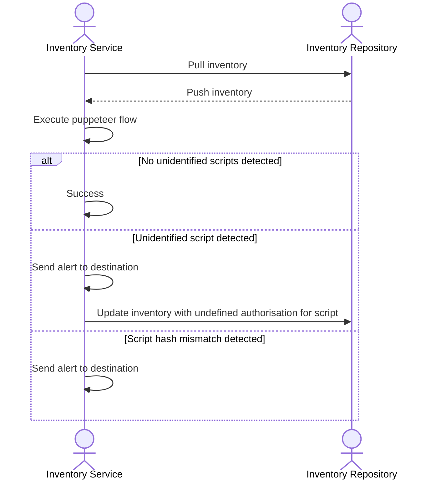
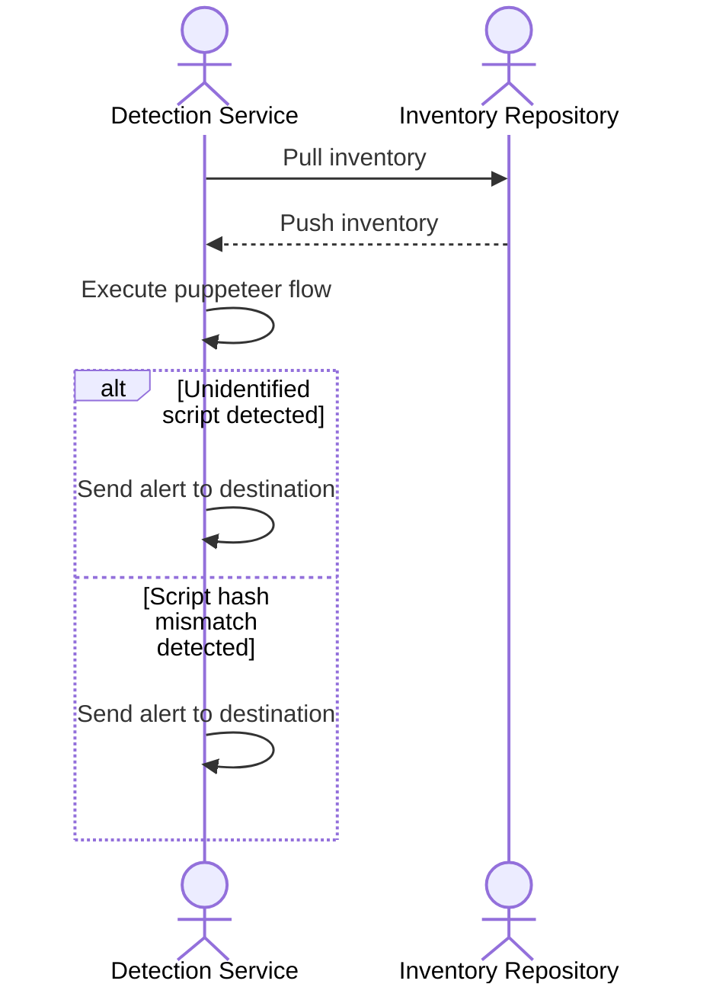

- Start Date: 2025-08-08
- Owning Team: TBD
- Product Document: TBD

# Summary

This will be two new services to help us comply the following PCI DSS requirements:

- [PCI DSS 6.4.3: Script Management](#pci-dss-643-script-management)
- [PCI DSS 11.6.1: Detection and Alerting](#pci-dss-1161-detection-and-alerting)

It will involve continuous monitoring, detection, and alerting of scripts running within both of our product offerings:

- [2.0](https://github.com/mr-yum/)
- [1.0](https://dev.azure.com/meandu/OrderingPlatform)

# Motivation

PCI DSS 4.x introduced new page tampering prevention requirements 6.4.3 and 11.6.1. These requirements were added to ensure that:

1. Unauthorised code cannot be executed in the payment page as it is rendered in the consumer’s browser and
2. That E-commerce skimming code or techniques cannot be added to payment pages as received by the consumer browser without a timely alert being generated. Anti-skimming measures cannot be removed from payment pages without a prompt alert being generated.

PCI DSS requirements 6.4.3 and 11.6.1, part of the PCI DSS v4.0 **focus on enhancing client-side security for payment pages**

Requirement 6.4.3 addresses the need to manage scripts on payment pages, ensuring they are authorised and their integrity is maintained. Requirement 11.6.1 mandates detecting and alerting on unauthorised modifications to security-impacting HTTP headers and scripts. These requirements are crucial for preventing e-skimming and Magecart attacks, which target client-side vulnerabilities.

### PCI DSS 6.4.3: Script Management

Organisations must maintain an inventory of all scripts executing on payment pages.

- **Authorization:** Each script must be authorised, meaning it should be reviewed and approved before being used.
- **Justification:** A written justification for each script's purpose and necessity should be documented.
- **Integrity:** Mechanisms must be in place to ensure the integrity of scripts, preventing unauthorised modifications.

### PCI DSS 11.6.1: Detection and Alerting

- **Monitoring:** Organisations must continuously monitor payment pages for changes to scripts and HTTP headers.
- **Alerting:** Unauthorised modifications should trigger alerts, notifying relevant personnel about potential security breaches.
- **Tamper Detection:** This requirement helps detect and prevent unauthorised changes to scripts, protecting against client-side attacks.

### Importance of Requirements:

- **Evolving Threat Landscape:** Cybercriminals are increasingly targeting client-side vulnerabilities to steal payment data.
- **Magecart Attacks:** These attacks involve injecting malicious code into e-commerce websites to steal payment information.
- **Protecting Sensitive Data:** These requirements are crucial for safeguarding sensitive payment data and preventing data breaches.

# Detailed Design

There will be two services to help us meet compliance requirements:

- Inventory service
- Detection service

The services will run on a regular schedule (CRON job) and will use of the following payload:

<details>

<summary>JSON Schema</summary>

```json
{
  "$schema": "https://json-schema.org/draft-07/schema#",
  "title": "Inventory and Detection Payload",
  "description": "Defines the configuration for an script inventory and detection job.",
  "type": "object",
  "properties": {
    "inventory_target": {
      "description": "The repository link to the inventory data",
      "type": "string",
      "format": "uri"
    },
    "detection_target": {
      "description": "The web application to monitor for script compliance against the inventory.",
      "type": "string",
      "format": "uri"
    },
    "puppeteer_flow": {
      "description": "The filename of the Puppeteer script used to navigate the application.",
      "type": "string"
    },
    "scripts": {
      "description": "An array of script definitions that have been inventoried.",
      "type": "array",
      "items": {
        "type": "object",
        "properties": {
          "name": {
            "description": "The file name of the script.",
            "type": "string"
          },
          "hashes": {
            "description": "A history of observed hashes for this script.",
            "type": "array",
            "items": {
              "type": "object",
              "properties": {
                "timestamp": {
                  "description": "The ISO 8601 timestamp when the hash was recorded.",
                  "type": "string",
                  "format": "date-time"
                },
                "hash": {
                  "description": "The SHA hash of the script's content.",
                  "type": "string"
                }
              },
              "required": ["timestamp", "hash"]
            }
          },
          "authorisation_justification": {
            "description": "The business or technical reason for authorizing this script. This is null or absent if the script is not yet authorised.",
            "type": ["string", "null"]
          }
        },
        "required": ["name", "hashes"]
      }
    },
    "headers": {
      "description": "A key-value map of expected HTTP headers found on the target page.",
      "type": "object",
      "additionalProperties": {
        "type": "string"
      }
    },
    "alerts": {
      "description": "Configuration for where to send different types of security alerts.",
      "type": "object",
      "properties": {
        "new_inventory_script_identified": {
          "description": "Alert config for when a new, unauthorised script is found during the inventory stage.",
          "type": "object",
          "properties": {
            "destination": {
              "type": "string",
              "description": "The destination channel or webhook for the alert."
            }
          },
          "required": ["destination"]
        },
        "uninventoried_script_detected": {
          "description": "Alert config for when a script not in the inventory is detected on the live page.",
          "type": "object",
          "properties": {
            "destination": {
              "type": "string",
              "description": "The destination channel or webhook for the alert."
            }
          },
          "required": ["destination"]
        },
        "mismatched_script_detected": {
          "description": "Alert config for when an inventoried script has a content hash that does not match its authorised version.",
          "type": "object",
          "properties": {
            "destination": {
              "type": "string",
              "description": "The destination channel or webhook for the alert."
            }
          },
          "required": ["destination"]
        }
      },
      "required": ["new_inventory_script_identified", "uninventoried_script_detected", "mismatched_script_detected"]
    }
  },
  "required": ["inventory_target", "detection_target", "puppeteer_flow", "scripts", "headers", "alerts"]
}
```

An example can be something like:

```json
{
  "inventory_target": "https://staging.meandu.app/pci-venue",
  "detection_target": "https://meandu.app/pci-venue",
  "puppeteer_flow": "2.0-add-to-cary-and-checkout.js",
  "scripts": [
    {
      // we might need to offer regexp or some other flexibility for names of auto-generated chunks
      "name": "https://static.meandu.app/app/front-end-web/**/_next/static/chunks/*.js",

       // contains previous history if we have it
      "hashes": [ { "timestamp": ... "hash": "hash1" }, { "timestamp": ... "hash": "hash1" } ],

      // undefined if not authorised yet (if inventory stage identified new script)
      "authorisation_justification": "Reason for use"
    }
  ],
  "headers": {
    "Content-Security-Policy": "policy details",
    "other-header": "header details"
  },
  "alerts" : {
    "new_inventory_script_identified": {
      // A new script was inventoried by the inventory stage, we don't have authorisation for it
      "destination": "#security_alerts"
    },
    "uninventoried_script_detected": {
      // Uninventoried script was detected by the detection stage
      "destination": "#security_alerts"
    },
    "mismatched_script_detected": {
      // Mismatched script was detected by the detection stage (hash mismatch)
      "destination": "#security_alerts"
    },
   }
}
```

</details>

## Inventory Service


(if you're not seeing a diagram here, install [Markdown Preview Mermaid Support](https://marketplace.cursorapi.com/items/?itemName=bierner.markdown-mermaid) extension)

As previously mentioned, this service will run on a schedule via a CRON job to detect any potential script violations for our applications.

Script violations can be one of the following:

- Unidentified script detected.
- Script mismatch detected.

### Unidentified Script Detected

When the service detects an unidentified script that doesn't exist within the inventory, it will perform the following actions:

- Send alert to the following target: `alerts.new_inventory_script_identified.destination`
  - The alert should contain the following details:
    - Script file name.
    - Script hash.
    - First seen timestamp.
- Add a new entry to: `scripts.items`
  - This entry should contain:
    - Script name.
    - Script hash (first seen timestamp and hash).
    - `authorisation_justification` should be set to null or omitted entirely.
- Push changes to the inventory repository.

### Script Mismatch Detected

A script mismatch occurs when the service detects a script that exists within the inventory, but the hash doesn't match any known hashes.

The behaviour in this case is to simply as follows:

- Send alert to the following target: `alerts.mismatched_script_detected.destination`

The alert should contain the following details:

- Script file name.
- Script hash.
- First seen timestamp.

## Detection Mechanism


(if you're not seeing a diagram here, install [Markdown Preview Mermaid Support](https://marketplace.cursorapi.com/items/?itemName=bierner.markdown-mermaid) extension)

This service will run in conjunction with the inventory service, and will run on a schedule via a CRON job.

The purpose of this service to read the inventory and report any script violations. There will be no writing or updating of the inventory.

Script violations can be one of the following:

- Unidentified script detected.
- Script mismatch detected.

### Unidentified Script Detected

When the service detects an unidentified script that doesn't exist within the inventory, it will perform the following actions:

- Send alert to the following target: `alerts.uninventoried_script_detected.destination`

The alert should contain the following details:

- Script file name.
- Script hash.
- First seen timestamp.

Please note that the target here differs from the inventory service, even though the alert is similar in nature. This is to help differentiate between the two services and will aid in the observability of detection location.

### Script Mismatch Detected

A script mismatch occurs when the service detects a script that exists within the inventory, but the hash doesn't match any known hashes.

The behaviour in this case is to simply as follows:

- Send alert to the following target: `alerts.mismatched_script_detected.destination`

The alert should contain the following details:

- Script file name.
- Script hash.
- First seen timestamp.

# Drawbacks

Why should we _not_ do this? Please consider:

- implementation cost, both in term of code size and complexity
- the cognitive load to teach developers the Mr Yum ecosystem
- integration of this feature with other existing and planned features
- cost of migrating existing features (is it a breaking change?)

There are tradeoffs to choosing any path. Attempt to identify them here.

# Alternatives

What other designs have been considered? What is the impact of not doing this?

# Adoption strategy

If we implement this proposal, how will existing developers adopt it? Is
this a breaking change? Which teams will be impacted downstream?

# How we teach this

What names and terminology work best for these concepts and why?
How is this idea best presented?
How should this feature be taught to existing developers?

# Unresolved questions

- Metrics & observability for solution
  - Do we want to emit metrics for all possible edge cases? (mismatch, new script, etc)
- What cloud native solution do we want to go with?
  - Lambda? ECS?
- How often should each service run?
  - Do we want to stagger the trigger for each service so that we potentially avoid stale inventory data?
- We have two very similar alerts for uninventoried/new script detected scenarios.
  - Do we want to combine the two given that they're very similar in nature? Keeping them separated could aid in observability of script detection.
