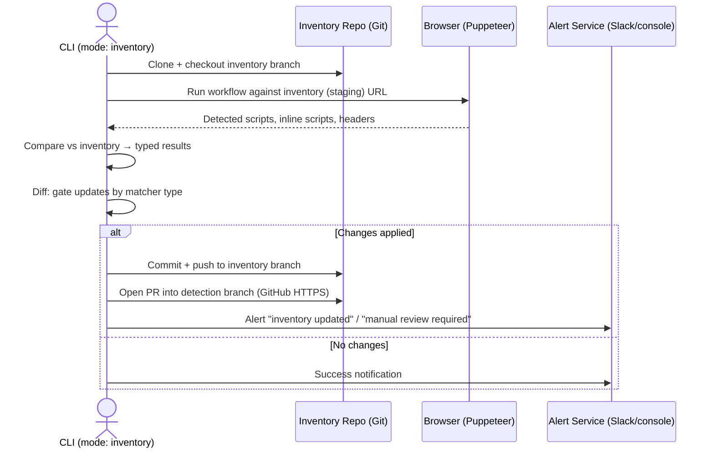
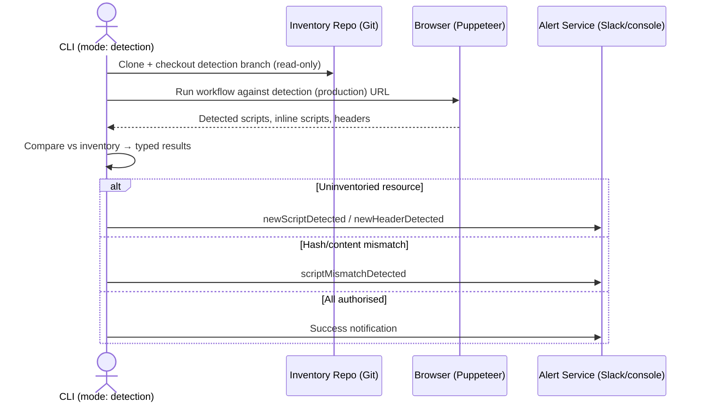

- Owning Team: TBD
- Product Document: TBD
- Status: Implemented

> This document describes the system as it works today. For day-to-day
> operator usage see the [README](../../README.md); for implementation
> guidance see [CLAUDE.md](../../CLAUDE.md).

# Summary

Two coordinated workflows help us comply with the following PCI DSS requirements:

- [PCI DSS 6.4.3: Script Management](#pci-dss-643-script-management)
- [PCI DSS 11.6.1: Detection and Alerting](#pci-dss-1161-detection-and-alerting)

They provide continuous monitoring, detection, and alerting of scripts and
security-impacting HTTP headers running within both of our product offerings:

- 2.0 (primary product)
- 1.0 (legacy product)

Both workflows are exposed through a single CLI/command-line tool run on a
schedule (GitHub Actions CRON). The tool drives real payment flows with
Puppeteer, captures every script and header the browser sees, and compares
what it finds against a versioned inventory stored in a **separate Git
repository**.

# Motivation

PCI DSS 4.x introduced new page tampering prevention requirements 6.4.3 and 11.6.1. These requirements were added to ensure that:

1. Unauthorised code cannot be executed in the payment page as it is rendered in the consumer’s browser, and
2. E-commerce skimming code or techniques cannot be added to payment pages as received by the consumer browser without a timely alert being generated. Anti-skimming measures cannot be removed from payment pages without a prompt alert being generated.

PCI DSS requirements 6.4.3 and 11.6.1, part of PCI DSS v4.0, **focus on enhancing client-side security for payment pages**.

Requirement 6.4.3 addresses the need to manage scripts on payment pages, ensuring they are authorised and their integrity is maintained. Requirement 11.6.1 mandates detecting and alerting on unauthorised modifications to security-impacting HTTP headers and scripts. These requirements are crucial for preventing e-skimming and Magecart attacks, which target client-side vulnerabilities.

### PCI DSS 6.4.3: Script Management

Organisations must maintain an inventory of all scripts executing on payment pages.

- **Authorization:** Each script must be authorised, meaning it should be reviewed and approved before being used.
- **Justification:** A written justification for each script's purpose and necessity should be documented.
- **Integrity:** Mechanisms must be in place to ensure the integrity of scripts, preventing unauthorised modifications.

### PCI DSS 11.6.1: Detection and Alerting

- **Monitoring:** Organisations must continuously monitor payment pages for changes to scripts and HTTP headers.
- **Alerting:** Unauthorised modifications should trigger alerts, notifying relevant personnel about potential security breaches.
- **Tamper Detection:** This requirement helps detect and prevent unauthorised changes to scripts, protecting against client-side attacks.

### Importance of Requirements

- **Evolving Threat Landscape:** Cybercriminals are increasingly targeting client-side vulnerabilities to steal payment data.
- **Magecart Attacks:** These attacks involve injecting malicious code into e-commerce websites to steal payment information.
- **Protecting Sensitive Data:** These requirements are crucial for safeguarding sensitive payment data and preventing data breaches.

# Detailed Design

The system is a single CLI tool with two coordinated workflows —
**inventory** and **detection** — over a shared matcher pipeline. Inventory
lives in a separate Git repository as an audit trail. The building blocks:

- **Four execution modes** (`inventory`, `detection`, `all`, `validate`).
- A **matcher pipeline** that splits `identifyWith` (which resource) from
  `authoriseWith` (is its content/hash acceptable), with `and`/`or` composites.
- **Typed comparison results** with a full-context `metadataPath` audit trail.
- **Gated inventory updates** and a **pull request** flow for human review.

## Execution modes

The tool is invoked as `npm start -- --mode <mode> ...`. See the
[README](../../README.md#cli-parameters) for the full parameter list.

- **`inventory`** — visit the staging/inventory URL for each target, discover
  scripts and headers, update the baseline, push to the inventory branch
  (`inventory-updates` by default), and **open a pull request** into the
  detection branch. Alerts on resources that require manual authorization.
- **`detection`** — visit the production/detection URL for each target,
  compare what loads against the approved inventory on the detection branch
  (`main` by default), and alert on anything unauthorized. **Read-only**
  against the inventory repo.
- **`all`** (default) — run `inventory`, then `detection`. Fails fast: if
  inventory fails, detection is skipped.
- **`validate`** — a CI gate for the inventory repo. Runs the full
  deserialization pipeline (Zod schema + `createMatcher()` + workflow file
  resolution) against every `targets/*.json`, then exits. No browser, no
  alerts, no push. Anything that passes `validate` will also load at runtime.

Exit codes: `0` success, `1` CLI/validation error, `2` execution error
(Git, network, workflow, or inventory-file failure).

## Inventory schema

Inventory lives in a **separate Git repository** as one JSON file per target
under `targets/<name>.json`. Each file names the two URLs to monitor, the
Puppeteer workflow to drive them, the alert destinations, and the approved
`scripts[]` and `headers[]`.

Each script/header entry uses two matchers:

- `identifyWith` — picks out the resource (e.g. by URL, header name, or host).
- `authoriseWith` — describes what content/hash is acceptable, and carries
  `authorisationInfo` (`description`, `authorised`, `date`). It may be a
  single matcher, a composite (`orMatcher`/`andMatcher`), or an **array**
  (syntactic sugar for OR — "any of these versions is acceptable").

<details>

<summary>Representative inventory file (targets/1.0.json)</summary>

```json
{
  "target": {
    "inventory": { "type": "inventory", "name": "1.0", "url": "https://staging.example.com/pci-venue", "workflow": "1.0.ts" },
    "detection": { "type": "detection", "name": "1.0", "url": "https://example.com/pci-venue", "workflow": "1.0.ts" }
  },
  "alerts": {
    "inventory": {
      "newScriptIdentified": { "destination": "#security_alerts" },
      "newHeaderIdentified": { "destination": "#security_alerts" }
    },
    "detection": {
      "newScriptDetected": { "destination": "#security_alerts" },
      "scriptMismatchDetected": { "destination": "#security_alerts" },
      "newHeaderDetected": { "destination": "#security_alerts" }
    },
    "successNotification": { "destination": "#pci_runs" }
  },
  "scripts": [
    {
      "identifyWith": { "nameMatcher": "^https://cdn\\.example\\.com/analytics\\.js$" },
      "authoriseWith": {
        "hashes": [{ "timestamp": "2025-10-21T12:00:00.000Z", "hash": { "value": "abc123..." } }],
        "authorisationInfo": {
          "description": "Analytics script for conversion tracking",
          "authorised": true,
          "date": "2025-10-21T12:00:00.000Z"
        }
      }
    },
    {
      "identifyWith": { "nameMatcher": "^https://cdn\\.example\\.com/app\\.js$" },
      "authoriseWith": [
        {
          "hashes": [{ "timestamp": "2025-10-01T00:00:00.000Z", "hash": { "value": "abc123..." } }],
          "authorisationInfo": { "description": "Version 1.0.0", "authorised": true, "date": "2025-10-01T00:00:00.000Z" }
        },
        {
          "hashes": [{ "timestamp": "2025-10-15T00:00:00.000Z", "hash": { "value": "def456..." } }],
          "authorisationInfo": { "description": "Version 1.1.0", "authorised": true, "date": "2025-10-15T00:00:00.000Z" }
        }
      ]
    }
  ],
  "headers": [
    {
      "identifyWith": { "headerNameMatcher": "^content-security-policy$" },
      "authoriseWith": {
        "andMatcher": [{ "contentMatcher": "default-src\\s+https:" }, { "contentMatcher": "script-src\\s+https:" }, { "contentMatcher": "object-src\\s+'none'" }],
        "authorisationInfo": {
          "description": "CSP requiring all three critical directives",
          "authorised": true,
          "date": "2025-10-24T12:00:00.000Z"
        }
      }
    }
  ]
}
```

</details>

## Matcher system

Matching is a strategy + composite pattern. Every detected resource is a
`Matchable` (`name`, `content`, optional `hash`, optional `url`), and every
matcher implements `identify()` (is this the resource I care about?) and
`authorize()` (is its content/hash acceptable?).

| Matcher             | Identifies by                           | Notes                                                     |
| ------------------- | --------------------------------------- | --------------------------------------------------------- |
| `nameMatcher`       | script URL/name (regex, case-sensitive) | external scripts with dynamic params                      |
| `headerNameMatcher` | header name (regex, case-insensitive)   | RFC 7230 semantics                                        |
| `contentMatcher`    | script/header content (regex)           | inline scripts, header values                             |
| `hashMatcher`       | SHA-256 of content                      | strict integrity; cannot identify, only authorise         |
| `hostMatcher`       | host portion of `url` (regex)           | origin cares, path doesn't; fails secure if `url` missing |
| `urlMatcher`        | full `url` (regex)                      | path precision; fails secure if `url` missing             |
| `orMatcher`         | any child matches (first-match-wins)    | composite                                                 |
| `andMatcher`        | all children match (short-circuit)      | composite, e.g. multi-directive CSP                       |

**Provenance (`url`).** `Matchable.url` is the single source of truth for
where a resource came from: for response headers it's the emitting response's
URL; for external scripts, the script's own URL; for inline scripts, the
initiator URL captured at insertion time by a page-attribution shim (falling
back to `location.href` for parser-inserted inline scripts). `hostMatcher`
and `urlMatcher` build on this — e.g. "only accept this CSP when it comes from
`*.checkout.example`".

Composite matchers nest to arbitrary depth (tested to 10 levels; 2–4 typical).
`authorisationInfo` may live at any level, and the full root-to-leaf chain is
collected into the comparison result's `metadataPath` for audit.

## Comparison pipeline

For each detected resource the relevant comparison service walks the inventory
entries **in order** and returns the first entry whose `identifyWith.identify()`
is true (first-match-wins). It then runs `authoriseWith.authorize()`. The
outcome is one of six typed results (a discriminated union):

- **Scripts:** `UnknownScriptFound`, `KnownScriptWithUnauthorisedContentFound`,
  `AuthorizedScriptFound`.
- **Headers:** `UnknownHeaderFound`, `KnownHeaderUnauthorisedContentFound`,
  `AuthorizedHeaderFound`.

Fail-secure: null/empty content yields `UnknownScriptFound` (it cannot be
safely matched). The `Known*WithUnauthorisedContent` results carry the matched
inventory entry, the failing matcher, a failure reason, and the `metadataPath`
so alert handlers have full context without additional queries.

## Inventory workflow



Key behaviours:

- **Gated updates.** Discoveries only mutate the inventory automatically when
  it is safe to do so — a new resource is added as a fresh entry, and a
  changed hash/content is appended **only** when the existing entry's
  authoriser is hash-based or an `OrMatcher`. `AndMatcher`, `contentMatcher`,
  and `nameMatcher` authorisers are left untouched and flagged for manual
  review, so the system never silently weakens an operator's policy.
  `InventoryDifferenceResult.appliedResults` records what actually changed,
  keeping "inventory updated" alerts truthful.
- **Pull requests.** After a push, the tool opens a PR from the inventory
  branch into the detection branch (GitHub HTTPS repos only). This forces the
  inventory repo's `validate` CI check to run and gives a human the chance to
  add/adjust `authorisationInfo` before the baseline reaches production
  detection. PR creation failure fails the run and alerts operators.

## Detection workflow



Detection never writes to the inventory. Uninventoried and mismatched
resources route to the mode-specific `detection.*` alert destinations, which
are kept distinct from the inventory-mode destinations to aid observability of
_where_ a violation was found.

## Workflows (Puppeteer flows)

Workflows are typed `WorkflowDefinition` objects in
[`src/workflows/`](../../src/workflows/) (e.g. `1.0.ts`, `2.0.ts`), referenced
by filename from a target's `workflow` field. Each is a list of steps; a step
has a `description`, a `waitFor` selector list (`button`, `input`, `href`,
`h2`/`h3`, `div`, `span`), and an `action` (`click`, `input`, `navigate`,
`escape`, `clickPopup`) with optional `value`, `delay`, and `waitForNavigation`.
The detection service executes each step, then scans for newly-inserted inline
scripts after every action so dynamically-added scripts are captured.

## Alerting

A single `IAlertService` (Slack or console) handles all output:

- `alertForTypedResults(...)` — routes violation/discovery results to the
  correct destination, and in inventory mode distinguishes "inventory updated"
  from "manual review required" using the diff's `appliedResults`.
- `alertOnSuccess(...)` — an informational summary (mode, targets, resource
  counts, duration) sent to the dedicated `successNotification` destination.
- `alertOnPullRequestFailure(...)` — surfaces PR-creation failures so a human
  can open the PR manually.

Omitting `--slack-token` falls back to the console service for local testing.

# Drawbacks

- **Complexity.** The matcher pipeline, composite nesting, and typed result
  union are considerably more code and concepts than hash-only matching. New
  contributors must learn the `identify` vs. `authorise` distinction and the
  fail-secure rules.
- **Two repositories.** Inventory lives in a separate repo with its own CI
  (`validate`), which is powerful for audit but adds operational surface.
- **Browser-driven detection is brittle.** Workflows encode real UI selectors
  and payment steps; UI changes can break a flow and produce false negatives
  until the workflow is updated.
- **Human-in-the-loop latency.** Gated updates + PR review mean newly
  legitimate scripts are not trusted by detection until a human approves and
  merges — intentional, but it introduces a lag operators must manage.

# Alternatives

- **CSP-only / browser-native reporting** (e.g. CSP `report-uri`) was
  considered but does not by itself satisfy the 6.4.3 inventory/justification
  requirement, and gives weaker integrity guarantees than hashing observed
  content.
- **A hosted third-party page-monitoring product** would reduce build cost but
  at ongoing licensing cost and with less control over the exact evidence
  produced for our QSA.
- **Hash-only matching** cannot express real-world policies (dynamic script
  URLs, multi-directive CSPs, multiple acceptable versions) without either
  constant false positives or unsafe blanket allowances, which is why the
  matcher pipeline exists.

# Adoption strategy

The system runs as scheduled GitHub Actions against existing targets; there is
no change required of product developers day-to-day. The people who interact
with it are the operators who review inventory PRs. Onboarding is via the
[README](../../README.md) (operating the CLI and branch model) and
[CLAUDE.md](../../CLAUDE.md) (architecture). Inventory files must use the
`identifyWith`/`authoriseWith` schema; the `validate` mode rejects malformed or
unsupported entries before they can merge.

# How we teach this

- The core vocabulary is **identify vs. authorise**, **inventory vs.
  detection**, and **matcher** (with composites `and`/`or`). These names are
  used consistently across code, docs, and alerts.
- Alerts are the primary teaching surface for operators: each names the
  target, the resource, and why it violated policy, with a link to review.
- The `validate` mode is the safety net that lets people edit inventory JSON
  confidently — it runs the exact runtime loader in CI.

# Unresolved questions

- **Metrics & observability.** We emit Slack alerts and success
  notifications, but do not yet emit structured metrics (per-target run
  duration, violation counts, mismatch rates) to a metrics backend.
- **Scheduling cadence.** Inventory and detection currently run in the same
  daily job; staggering them (inventory earlier, detection later) would reduce
  the risk of detection reading stale inventory.
- **Consolidating discovery alerts.** `new*Identified` (inventory) and
  `new*Detected` (detection) remain intentionally separate for observability;
  whether to merge them is still open.
